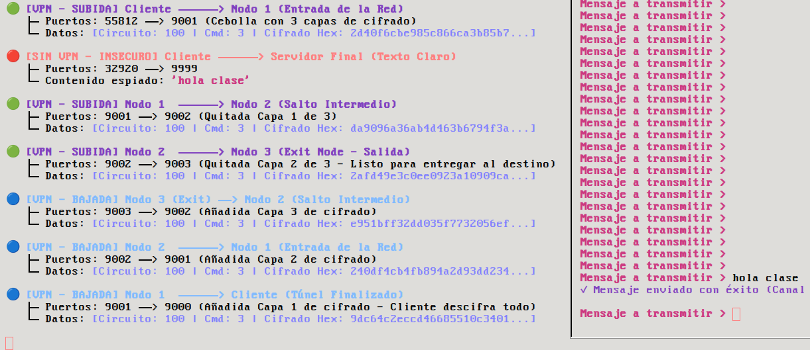

# 🧅 Onion VPN Transparent
### Interceptación L3 y Aislamiento de Privilegios
**IIC2531 - Entrega Final**
Denis González & Pedro González

---

## 🎯 1. Modelo de Amenazas

| Componente | Detalle Técnico |
| :--- | :--- |
| **Entorno** | Redes locales compartidas (Wi-Fi Público Abierto) |
| **Atacante** | Sniffer pasivo local (ej. Wireshark / tcpdump) |
| **Objetivo** | Interceptar datos en texto plano y asociarlos a la IP de origen |
| **Solución** | Cifrado de extremo a extremo + Anonimato del remitente |

---

## 🛡️ 2. Arquitectura (Separación de Privilegios)
*Inspirado en el modelo de aislamiento de OpenSSH (Clase 06)*

```text
 ┌────────────────────────────────────────────────────────┐
 │                   SISTEMA OPERATIVO                    │
 │                                                        │
 │  ┌───────────────────────┐      ┌───────────────────┐  │
 │  │ vpn-bridge (C++)      │      │ vpn-core (Go)     │  │
 │  │                       │      │                   │  │
l│  │ - MODO: ROOT          │      │ - MODO: USUARIO   │  │
 │  │ - TCB Mínimo (~100LOC)│      │ - Criptografía    │  │
 │  │ - Interfaz vpn0       │      │ - Sockets Públicos│  │
 │  └───────────┬───────────┘      └─────────┬─────────┘  │
 │              │                            │            │
 │              └────► [ /tmp/onion_vpn.sock ] ◄─────┘    │
 │                        (UNIXGRAM IPC)                  │
 └────────────────────────────────────────────────────────┘

```

---

## 📟 3. Mecanismo de Interceptación (Capa 3)

```text
 [ Aplicación Local ] ──► (Genera Paquete IP Crudo)
                                 │
                                 ▼
 [ Kernel de Linux  ] ──► (Tabla de rutas desvía a vpn0)
                                 │
                                 ▼
 [ vpn-bridge (C++) ] ──► (Lectura tun_fd via poll() asíncrono)
                                 │
                                 ▼
 [ Canal Local IPC  ] ──► (SOCK_DGRAM: Envío atómico 1-a-1)
                                 │
                                 ▼
 [ vpn-core (Go)    ] ──► (Recepción del buffer de Capa 3)

```

---

## 🔑 4. Pipeline Criptográfico de la Cebolla

### `ECDH P-256 (Llaves Efímeras)` ──► `SHA-256 (Derivación)` ──► `AES-GCM (Cifrado Autenticado)`

```text
   CLIENTE                     NODO 1             NODO 2             NODO 3
[ Paquete IP ]
      │
 Cifrar K3 (Exit)
      │
 Cifrar K2 (Mid)
      │
 Cifrar K1 (Entry)
      │
 [Celda Cifrada] ───► UDP :9001 ───►
                                      │
                                Descifrar K1
                                      │
                                [Celda 2 Capas] ───► UDP :9002 ───►
                                                                     │
                                                               Descifrar K2
                                                                     │
                                                               [Celda 1 Capa] ───► UDP :9003 ───► [Paquete IP Plano]

```

---

## 🧪 5. Demostración Empírica (Evidencia en Vivo)


---

## 📊 6. Análisis Métrico del Tráfico

* 🔴 **Fuga Directa (Puerto 9999):** Payload `"hola clase"` legible en texto claro ASCII.
* 🟢 **Subida Onion:** Flujo asíncrono `9001 ──► 9002 ──► 9003`. Ruido hex mutando en cada nodo.
* 🔵 **Bajada (Retorno):** Re-encapsulamiento y viaje inverso simétrico.
* 📉 **Contracción Matemática:** Reducción de 28 bytes por salto.

$$\Delta = 12 \text{ bytes (Nonce)} + 16 \text{ bytes (Tag Autenticación GCM)}$$


---

## 🏁 7. Diagnóstico Técnico

| Eje | Desafío / Limitación | Mitigación / Trabajo Futuro |
| --- | --- | --- |
| **OS** | Bloqueos de interfaces TUN en macOS | Despliegue en entornos nativos Linux |
| **Red** | Overhead y latencia por triple salto UDP | Trade-off asumido para asegurar anonimato |
| **Cripto** | Simulación estática de circuitos | Handshake dinámico DH en tiempo de ejecución |
| **Escala** | Monocliente | Soporte multicliente con aislamiento de estados |
```


